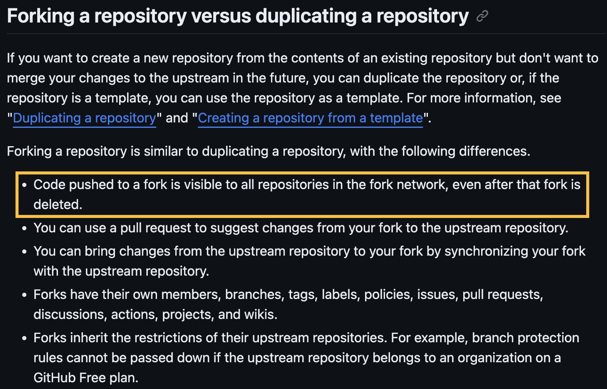
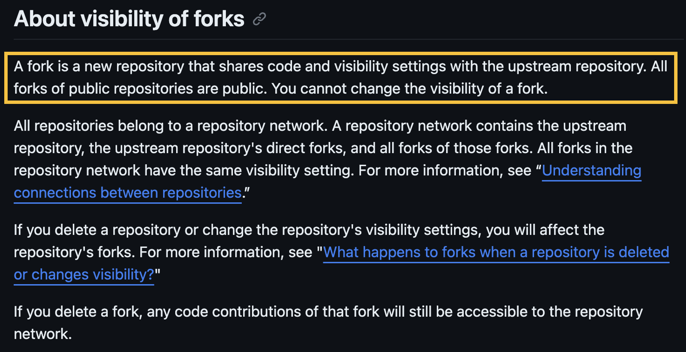
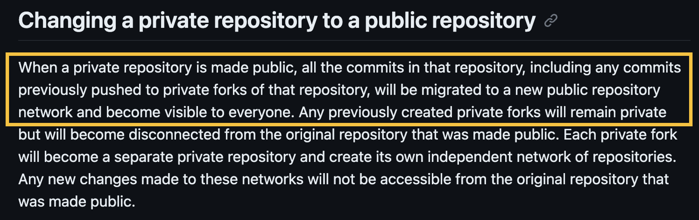
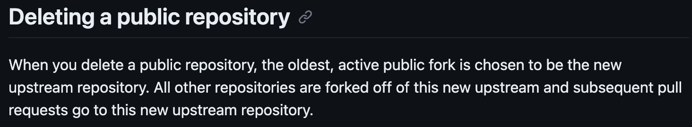

## OSINT Challenge Concept

An obscure (but intended) behaviour of github repositories is that making a private repo public exposes all commits made in _ANY_ repository in the fork network. Below I will briefly describe the behaviour and setups.

Credit: [Truffle Security Co.](https://trufflesecurity.com/blog/anyone-can-access-deleted-and-private-repo-data-github)'s blog post on accessing deleted and private repository data on GitHub.  
_This readme briefly describes the potential of this feature, and also serves as a quick reference guide. For more info, do check out the above article_

- [Challenge Idea](#challenge-idea)
- [General Setup](#general-setup)
- [GitHub Policy](#github-policy)
- [Implication (taken from Truffle Security Co.)]()

## Challenge Idea

### Story

_Recently, someone has be harassing \<CTF>'s twitter account. Ever since we publicised about \<this ctf>, someone has been spamming in our comments about wanting to write a challenge for us. With exams around the corner, we don't really have time to vet him. Help us check him out, maybe look at his twitter history or something, make sure there's no red flags._

### Twitter Setup

**Under Comments Section:**
Post random things about "creating challenges" and "joining as a challenge creator"
Include a "check out my twitter" in the original publicity post.

**Twitter post:** (oldest -> newest)

_**Post 1:**_

Hey! Just created a new twitter account! About myself: I'm an aspiring CTF challenge creator. When I have more challenge, I will prob post bout them later or somthing.

_**Post 2:**_

Today I learnt about forking on github. Not sure what thats about, maybe I should try creating {TODO}

_**Post 3:**_

:triangular_flag_on_post::triangular_flag_on_post:I'm writing a new challenge. idk what's the normal procedure for storing the flags, so I'm just gonna store it in my repo. Even blocked out the flag and cropped out my username so yall trollers cant find it :):triangular_flag_on_post::triangular_flag_on_post:

- And post a picture with the flag blocked and the username, repo name, and commit hash cropped out.

_**Post 4:**_

- Post something to clue people into his github username, maybe something like:

I always wanted to get a motorcycle. A red Ducati to be exact, maybe event buy some vanity plate like '777'! Ducati777 i like the sound of that. Looking forward to when I become a successful CTF challenge creator and bring in the greens :moneybag::moneybag:

_**Post 5:**_

{coming soon}

## General Setup

1. Created an organization, let's say I created an organization called `OSINTrial`.
   - Ensure the organization's setting allows forking of private repos.
   - Setting -> Member privileges -> Repository forking -> Allow forking of private repositories.
   - _I think is not strictly necessary unless you are on your own._
2. Create a **private** repo in this organization, let's call it `upstream_project`.
   - We will make this repo public on step 6. This is to simulate open-sourcing a project.
3. Fork this private repo, let's call it `internal_fork`
   - The repo can belong to any organization or any user. It doesn't seem to affect the setup.
4. Make some secret commits on `internal_fork` that you don't want made public.
5. Change the visibility of `upstream_project` from private to public.
   - Simulate open-sourcing a project.
6. (somehow, maybe through osint) Obtain the SHA-1 hash of the commit
7. View the "private" commit through the public repo using the SHA-1 hash.
   - Eg. https://github.com/OSINTrial/public_repo_side/commit/96421e1e9c970e3ff6f21dfb24bf55cdac082994 for this repo.

**Bonus 1:** When viewing the "private" commit, you can actually see and access the parent commit. This opens up the door for traversing the commit chain, albeit only in one direction. 
**Bonus 2:** View commits from deleted repo has a very similar workflow. This is a result of commits being shared across the fork network, therefore accessible by any repo in the fork network even after the original repo is deleted.

## GitHub Policy

Looking at GitHub's documentation, you will realise that it is in fact intended that any commits made on a repository is visible by the entire fork network, regardless of the visibility of the said repo.

Source: [GitHub Doc: About forks](https://docs.github.com/en/pull-requests/collaborating-with-pull-requests/working-with-forks/about-forks#forking-a-repository-versus-duplicating-a-repository)

All forks in a fork network should have the same visibility, as visibility is inherited from the parent, and cannot be changed (in the fork). Therefore, even if commits are visible by the whole network, the network is either all public or all private so it doesn't pose as big a security issue. (if someone has unauthorised access to your private fork network, i think you have bigger concerns)

Source: [GitHub Doc: About permissions and visibility of forks](https://docs.github.com/en/pull-requests/collaborating-with-pull-requests/working-with-forks/about-permissions-and-visibility-of-forks#about-visibility-of-forks)

While on its own this feature is quite harmless, it poses a security issue when organizations open source their projects while maintaining private internal repos. In particular, if the open-sourcing is done after having committed some sensitive information to another private repo in the fork network.

Source: [GitHub Doc: What happens to forks when a repository is deleted or changes visibility?](https://docs.github.com/en/pull-requests/collaborating-with-pull-requests/working-with-forks/what-happens-to-forks-when-a-repository-is-deleted-or-changes-visibility#changing-a-private-repository-to-a-public-repository)

Thankfully, once the repo is made public, it severs all connection to the private fork network, so any sensitive commits made after the visibility change is safe. However, any prior commits are fair game.

Furthermore, these "exposed" sensitive commits could be perpetually exposed if a fork was made before the mistake was realised. Suppose you are the manager, and this was brought to your attention. Your first thought is probably to delete the public repo, afterall you still have your internal private repo as backup.

Unfortunately for you, even if you delete the public repo, the oldest active public fork will take over as the new upstream repo, allowing anyone to access your sensitive commits through this new upstream repo. In short, you are fucked.

Source: [GitHub Doc: What happens to forks when a repository is deleted or changes visibility?](https://docs.github.com/en/pull-requests/collaborating-with-pull-requests/working-with-forks/what-happens-to-forks-when-a-repository-is-deleted-or-changes-visibility#deleting-a-public-repository)

## Implication (taken from Truffle Security Co.)

We have a few takeaways from this:

1. As long as one fork exists, any commit to that repository network (ie: commits on the “upstream” repo or “downstream” forks) will exist forever.
   - This further cements the view that the only way to securely remediate a leaked key on a public GitHub repository is through key rotation. Check Truffle Security's documentation on how to rotate keys for the most popularly leaked secret types: [howtorotate.com](https://howtorotate.com/docs/introduction/getting-started/).
2. GitHub’s repository architecture necessitates these design flaws and unfortunately, the vast majority of GitHub users will never understand how a repository network actually works and will be less secure because of it.
3. As secret scanning evolves, and we can hopefully scan all commits in a repository network, we’ll be alerting on secrets that might not be our own (ie: they might belong to someone who forked a repository). This will require more diligent triaging.

4. While these three scenarios are shocking, that doesn’t even cover all of the ways GitHub could be storing deleted data from your repositories. Check out [this post](https://trufflesecurity.com/blog/trufflehog-scans-deleted-git-branches) about how you also need to scan for secrets in deleted branches.

Finally, while this is focused on GitHub, it’s important to note that some of these issues exist on other version control system products.
